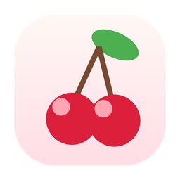

    
    <h1>Cherry</h1>

Cherry is a menu bar manager for macOS. It hides, shows, and rearranges menu bar items, and lets you customize the menu bar's appearance.

> **Cherry is a fork of [Ice](https://github.com/jordanbaird/Ice) by Jordan Baird** (based on Ice's `macos-26` branch), with a rebrand and macOS 26 fixes. The entire menu-bar engine is Ice's work, Cherry just repackages it. Licensed under **GPL-3.0**, same as Ice. If you want the original, actively maintained project, use [Ice](https://github.com/jordanbaird/Ice).

## Download

Grab the latest `Cherry.dmg` from the [Releases page](https://github.com/brendanrong/Cherry/releases/latest). Open it, drag Cherry into Applications, and launch. On first run, grant **Accessibility** (and **Screen Recording**) in System Settings so it can manage the menu bar.

Requires macOS 14 or later.

## Features

**Menu bar item management**

- Hide menu bar items, with an "always-hidden" section
- Show hidden items on hover, click, scroll, or swipe
- Automatically rehide
- Drag-and-drop layout to arrange items
- Show hidden items in a separate bar (handy for notch Macs)
- Search menu bar items
- Menu bar item spacing (beta)

**Appearance**

- Menu bar tint (solid and gradient), shadow, and border
- Custom menu bar shapes (rounded and/or split)

Plus global hotkeys, launch at login, and automatic updates.

## Credits

Cherry is built entirely on **[Ice](https://github.com/jordanbaird/Ice)** by **Jordan Baird** (© 2024 Jordan Baird). Cherry's modifications are © 2026 Brendan Rong. Huge thanks to Jordan and the Ice contributors for the original work.

## License

GPL-3.0, inherited from Ice. See [LICENSE](LICENSE).
